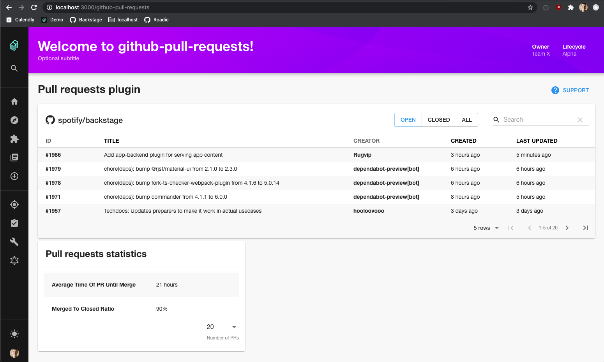

# GitHub Pull Requests Plugin for Backstage



## Setup

1. If you have standalone app (you didn't clone this repo), then do

```bash
yarn add @roadiehq/backstage-plugin-github-pull-requests
```

3. Add plugin to the list of plugins:

```ts
// packages/app/src/plugins.ts
export { plugin as GithubPullRequests } from '@roadiehq/backstage-plugin-github-pull-requests';
```

4. Add plugin API to your Backstage instance:

```ts
// packages/app/src/apis.ts
import { GithubPullRequestsClient, githubPullRequestsApiRef } from '@roadiehq/backstage-plugin-github-pull-requests';

export const apis = (config: ConfigApi) => {
  // ... lots of lines omitted ...
  builder.add(githubPullRequestsApiRef, new GithubPullRequestsClient());
};

```

5. Run app with `yarn start` and navigate to `/github-pull-requests`

## Features

- List Pull Requests for your repository, with filtering and search.
- Show basic statistics about pull requests for your repository.

## Links

- [Backstage](https://backstage.io)
- Get hosted, managed Backstage for your company: https://roadie.io
